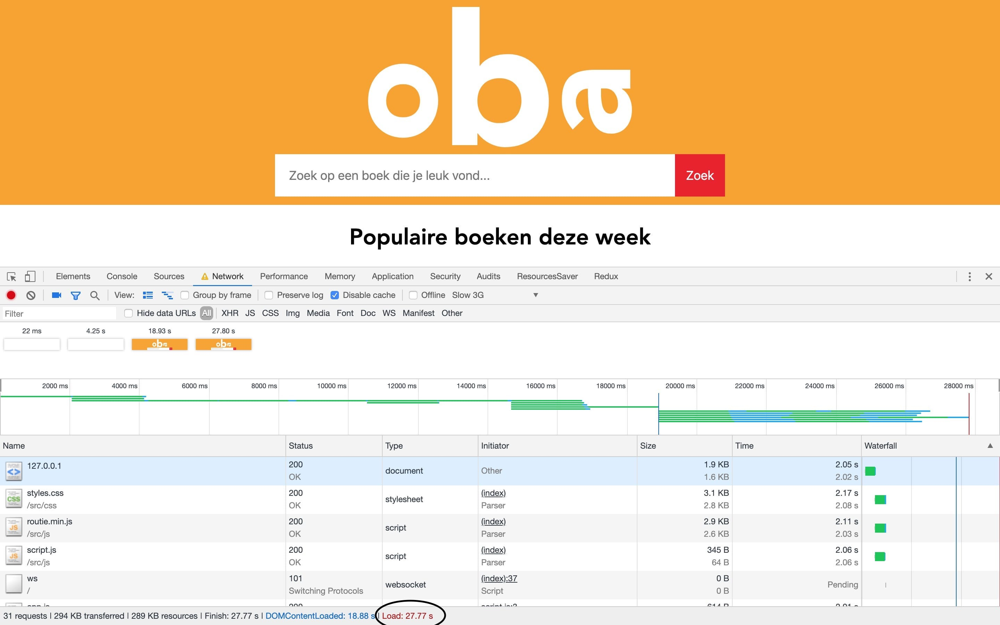
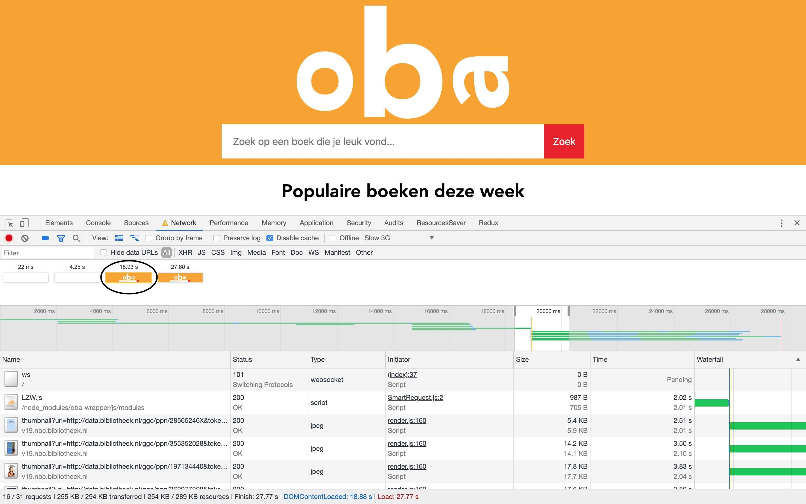
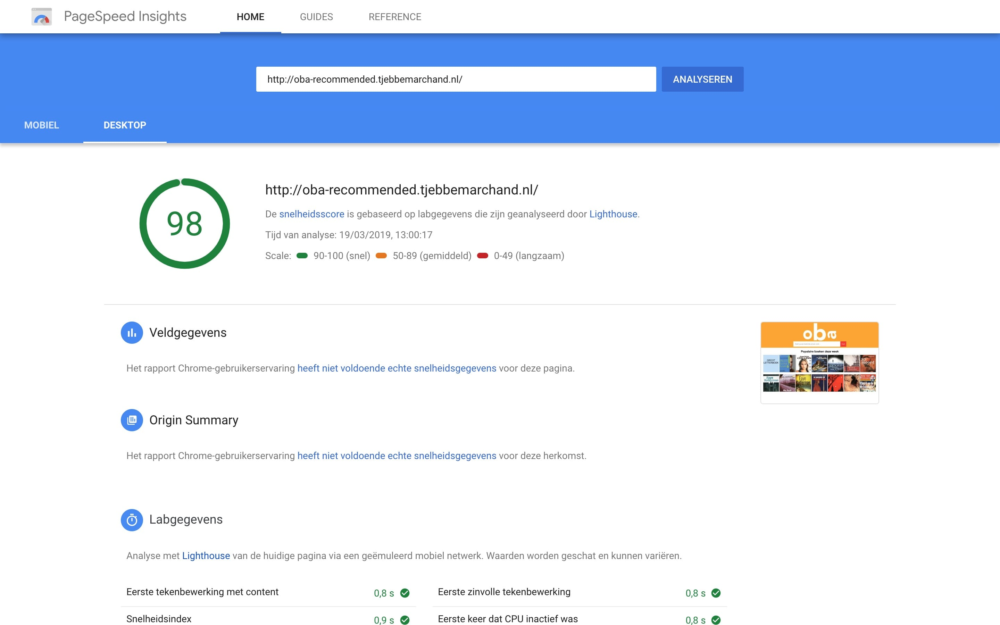
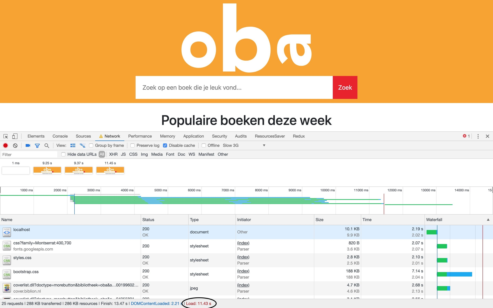
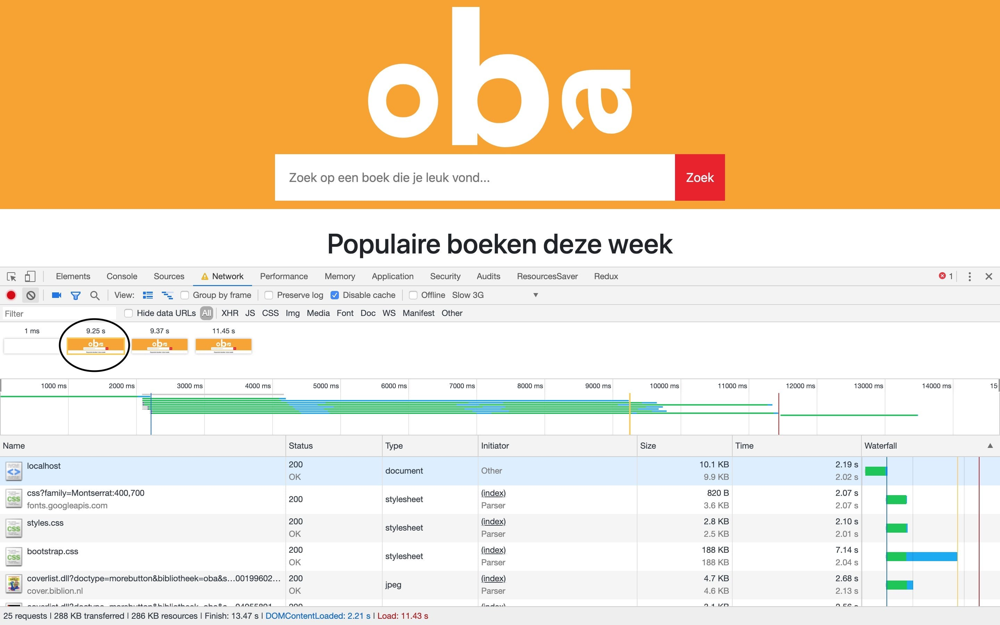

# Performance Matters

## Installation

To install the OBA server side app, you need to clone this repository. After that you can run NPM install on the directory of the app to install all the dependencies the app needs.

    $ git clone https://github.com/tjebbemarchand/tjebbe-wafs.github.io.git
	$ npm install

## Performance
### Before performance enhancements
I tested my OBA app on slow 3G connection on client side rendering.

The total load time is 27.7 seconds.

The first paint on client side rendering:

The first paint is 18.9 seconds.

Google page speed test gives the following result:

But still there are optimizations to consider doing.

### After performance enhancements
#### Server side rendering
When the OBA app was server side renderd, the performance inceasded by a lot with a slow 3G connection.

The load time descreased from 27.7 seconds to 11.4 seconds.

The first paint on server side rendering:

The first paint of the app decreased from 18.9 seconds to 9.3 seconds.

#### First view
I want to decrease the time for first paint render. On slow 3G connection the first paint render is 9.3 seconds. That is a bit to long.
I want to achieve this 

## Tooling
I used NPM scripts to prefix and minify my CSS stylesheet. To run the build css command, simply run the following command in your terminal.

    $ npm run build:css
