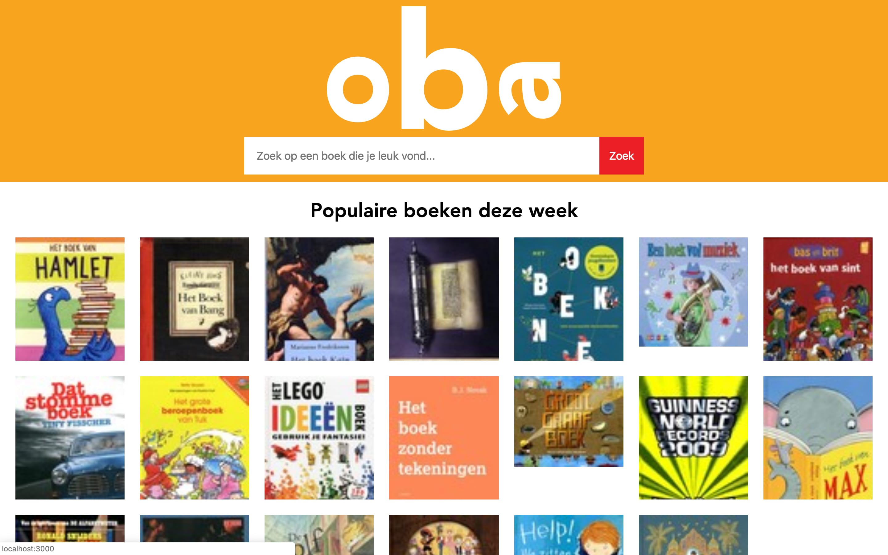
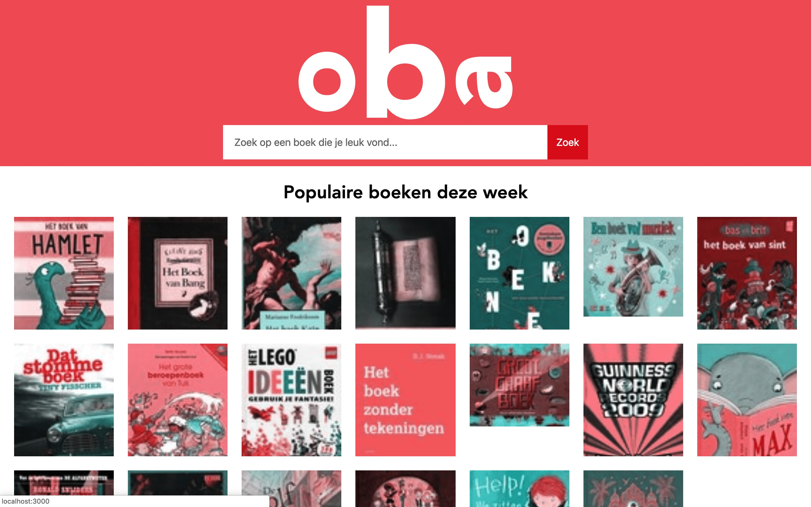
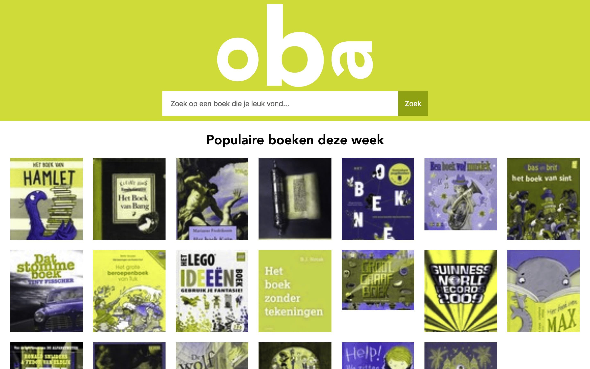

# Server side OBA app

## Performance Matters
### Installation
To install the OBA server side app, you need to Git clone the repository. After that you can run an NPM install on the directory of the app to install all the dependencies the app needs.

    ```
    # git clone https://github.com/tjebbemarchand/tjebbe-wafs.github.io.git
    # npm install
    ```

### Tooling
I used NPM scripts to prefix and minify my CSS stylesheet. To run the build css command, simply run the following command in your terminal.

    ```
    # npm run build:css
    ```


## Browser Technologies
### Testing features
#### Colors
##### Problem
I installed a Chrome plugin to check for color blindness on my OBA app. The app that i installed is called. [Colorblindly](https://chrome.google.com/webstore/detail/colorblindly/floniaahmccleoclneebhhmnjgdfijgg).
Here you can check different kinds of color blindness for contrast on contrast.





##### Solution
Colorblindness is not an issue for my app. On every tone of color it is still visible for the user.

#### Custom fonts
No using custom fonts

#### No mouse and trackpad
##### Problem
The tab key doesn't detect the a tags on the page only the inputs.

##### Solution
I inserted a tabindex of 0 on every a tag on the page. Now the tab does detect all the a tag and also the input fields.

#### No JavaScript
##### Problem
No problem so far.

##### Solution
If i turn off JavaScript in my browser, app stil works as should. I think that's because everything is written in NodeJS.

#### Cookies
No using cookies

#### LocalStorage
No using LocalStorage