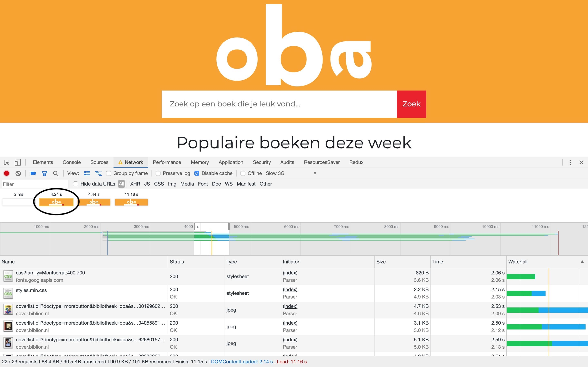

# Performance Matters

## Installation

To install the OBA server side app, you need to clone this repository. After that you can run NPM install on the directory of the app to install all the dependencies the app needs.

    $ git clone https://github.com/tjebbemarchand/tjebbe-wafs.github.io.git
	$ npm install

## Performance
### Before performance enhancements
I tested my OBA app on slow 3G connection on client side rendering.
The total load time is 27.7 seconds.

The first paint on client side rendering:
The first paint is 18.9 seconds.

Google page speed test gives the following result:

But still there are optimisations to consider doing.

### After performance enhancements
#### Server side rendering
When the OBA app was server side renderd, the performance increased by a lot with a slow 3G connection.
The total load time descreased from 27.7 seconds to 11.4 seconds.

The first paint on server side rendering:
The first paint of the app decreased from 18.9 seconds to 9.3 seconds.

#### First view
I want to decrease the time for first paint render. On slow 3G connection the first paint render is 9.3 seconds. That is a bit to long.
I want to achieve this by a couple of steps
 - Remove unused CSS code
 - Merge CSS files
 - Minify CSS files
 - Compression
 
 After i implemented the first view optimalisations, my OBA app increased a lot in speed.

 The first paint on server side rendering with first view optimalisations:
 It went from 9.3 seconds to 4.2 seconds on slow 3G connection.
 

#### Image loading
 - Responsive images

I added a responsive image for 1 result. So i can practice with this syntax. I made 3 different sizes of images and loaded them in with srcset. On a big screen, the app grabs the biggest image available. And on very small screens, it grabs the smallest one to limit bandwith.
The difference between de big image and the small image equals to 50kb. This is a big change on slow connections.

    "
		  srcset="img/book-cover-big.jpg 500w, img/book-cover-medium.jpg 250w, img/book-cover-small.jpg 70w"
		  sizes="(max-width: 500px) 12vw, (max-width: 768px) 25vw, (max-width: 1280px) 50vw, 100px"
	      src="img/book-cover-medium.jpg">

#### Repeat view
For every page loads i can decrease the loading time by implementing some optimalisations.
 - Cache control

I enabled cache control for the next time a page loads. So it doesn't have to request the page from the server. I set the cache on a week so every week it doest a new request to the server for any changes.

    app.use((req, res, next)  => {
	    res.setHeader('Cache-Control', 'max-age=' +  7 *  24 *  60 * 60);
	    next();
    });

## Tooling
I used NPM scripts to prefix and minify my CSS stylesheet. To run the build css command, simply run the following command in your terminal.

    $ npm run build:css
